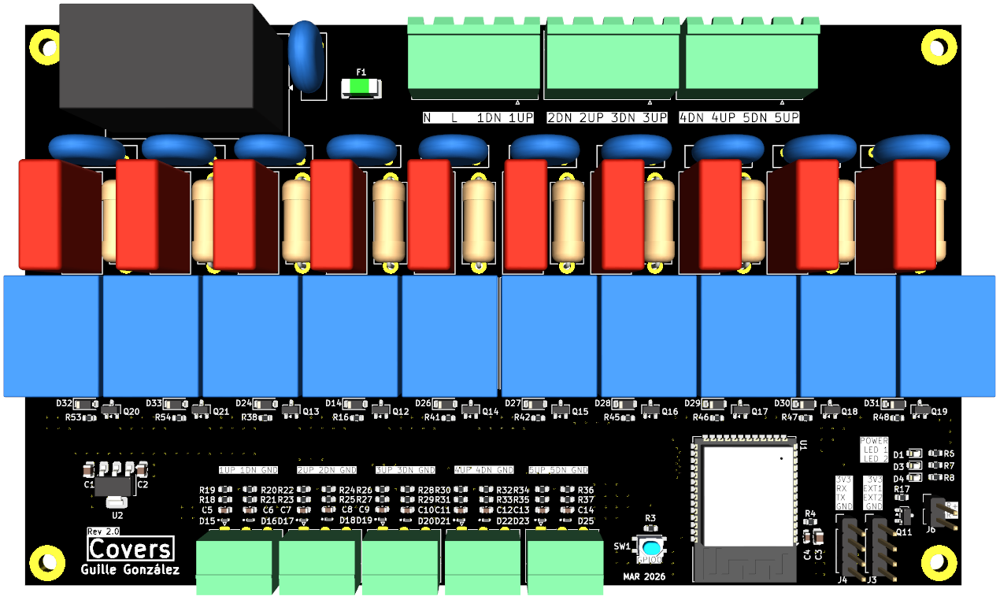

# Covers

## Description

'Covers' is a PCB designed to control x5 covers with 10 relays and automatize it with [Home Assistant](https://www.home-assistant.io/).

Firmware used in this device is [tasmota](https://tasmota.github.io/docs/), an open source firmware for ESP devices.

## Power supply

The board is powered with a 230VAC power supply.

## Microprocessor

Espressif [ESP32-S2-SOLO](https://www.espressif.com/en/products/modules) module (NRND).

## LEDs

//TODO: review

## Pin assignment

| PIN     | Func    |
| ------- | ------- |
| TODO    | TODO    |

## Enclosure (WIP)

* Custom made in [Fusion 360](https://www.autodesk.es/products/fusion-360/overview).

## Changelog

All notable changes to this project will be documented in this section.

The format is based on [Keep a Changelog](https://keepachangelog.com/en/1.0.0/)

## [2.0.0] - 202X-XX-XX

### Fix

## [1.0.0] - 202X-XX-XX

### Added

* xx
* xx

[Unreleased]: https://github.com/GuilleGonzzalez/hw-covers
[1.0.0]: https://github.com/GuilleGonzzalez/hw-covers
[2.0.0]: https://github.com/GuilleGonzzalez/hw-covers
