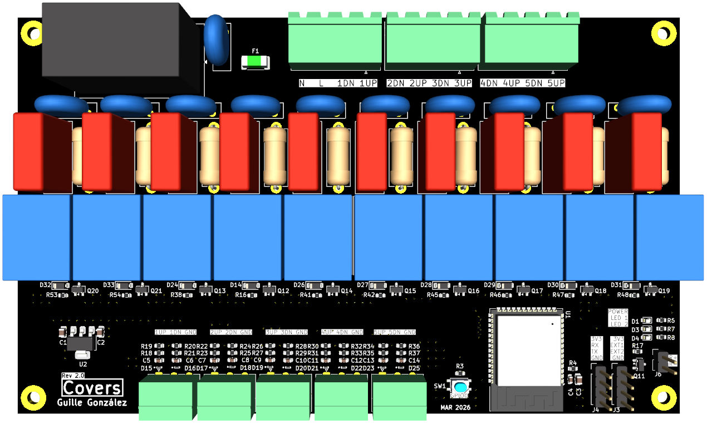

# Covers

## Description

'Covers' is a PCB designed to control x5 covers with 10 relays and automatize it with [Home Assistant](https://www.home-assistant.io/).

Firmware used in this device is [tasmota](https://tasmota.github.io/docs/), an open source firmware for ESP devices.

## Power supply

The board is powered with a 230VAC power supply.

## Microprocessor

Espressif [ESP32-S3-WROOM](https://www.espressif.com/en/products/modules) module.

## LEDs

2 user LEDs. Functionality to define

## Relay Mode

**Circuit Safe**
* Relay1: ON/OFF
* Relay2: UP/DOWN

A RC snubber has been added for all relays to absorb voltage spikes

## Tasmota config

An example template will be uploaded when configured.

## Pin assignment

| PIN     | Func    |
| ------- | ------- |
| OUT1    | GPIO12  |
| DIR1    | GPIO11  |
| OUT2    | GPIO14  |
| DIR2    | GPIO13  |
| OUT3    | GPIO47  |
| DIR3    | GPIO21  |
| OUT4    | GPIO18  |
| DIR4    | GPIO08  |
| OUT5    | GPIO16  |
| DIR5    | GPIO17  |
| 1IN1    | GPIO09  |
| 1IN2    | GPIO10  |
| 2IN1    | GPIO19  |
| 2IN2    | GPIO20  |
| 3IN1    | GPIO40  |
| 3IN2    | GPIO39  |
| 4IN1    | GPIO42  |
| 4IN2    | GPIO41  |
| 5IN1    | GPIO01  |
| 5IN2    | GPIO02  |
| IR      | GPIO06  |
| LED1    | GPIO15  |
| LED2    | GPIO07  |
| EXT1    | GPIO04  |
| EXT2    | GPIO05  |

## Enclosure

* Custom made.

## Changelog

All notable changes to this project will be documented in this section.

The format is based on [Keep a Changelog](https://keepachangelog.com/en/1.0.0/)

### [Unreleased]

### [2.1.0] - 2026-03-09

Fix some 2.0.0 rev issues

#### Added

* Add RC-snubbers values
* Add IR base resistor
* Add via stiching in regulator for power disipation

#### Fixed

* Fix L/N label text
* Isolate 230V AC lines from 5V DC lines

#### Changed

* Change relays transistor base from 1k to 470ohm

### [2.0.0] - 2026-03-08

Solved relay issue

#### Added

* Add RC snubbers
* Add schematic hierarchicals sheets

#### Fixed

* Change relays from 5A to 10A
* Change relay config to hardware-safe (output and direction) using form-C relays

#### Changed

* Change input resistor from 10k to 1k5
* Change ESP pin assignment

### [1.1.0] - 2025-02-28

Bug fixes

#### Added

* IR LED resistor value calculated: 180ohm

#### Fixed

* Relay NO/NC bug
* 1N4448W diode package fixed: SOD-123

#### Changed

* Better relays: 5A instead 3A, better pinout for clearance, thiner footprint
* HiLink symbol
* Rounded corners
* Components size: R/C 0603 instead 0402
* Inputs/outputs order: from left to right 1-5 in both cases

### [1.0.0] - 2025-02-05

First release

#### Added

* x5 covers

[Unreleased]: https://github.com/GuilleGonzzalez/hw-covers
[1.0.0]: https://github.com/GuilleGonzzalez/hw-covers/tree/v1.0.0
[1.1.0]: https://github.com/GuilleGonzzalez/hw-covers/tree/v1.1.0
[2.0.0]: https://github.com/GuilleGonzzalez/hw-covers/tree/v2.0.0
[2.1.0]: https://github.com/GuilleGonzzalez/hw-covers/tree/v2.1.0