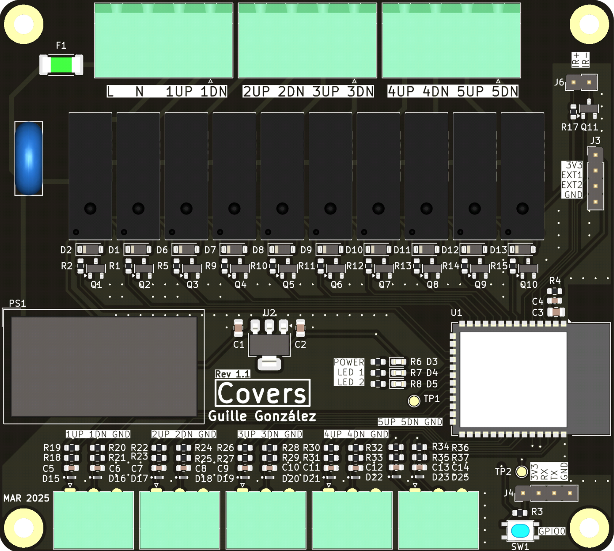

# Covers

## Description

'Covers' is a PCB designed to control x5 covers with 10 relays and automatize it with [Home Assistant](https://www.home-assistant.io/).

Firmware used in this device is [tasmota](https://tasmota.github.io/docs/), an open source firmware for ESP devices.

## Power supply

The board is powered with a 230VAC power supply.

## Microprocessor

Espressif [ESP32-S3-WROOM](https://www.espressif.com/en/products/modules) module.

## LEDs

2 user LEDs. Functionality to define

## Pin assignment

| PIN     | Func    |
| ------- | ------- |
| 1OUT1   | GPIO10  |
| 1OUT2   | GPIO09  |
| 2OUT1   | GPIO20  |
| 2OUT2   | GPIO19  |
| 3OUT1   | GPIO08  |
| 3OUT2   | GPIO18  |
| 4OUT1   | GPIO17  |
| 4OUT2   | GPIO16  |
| 5OUT1   | GPIO15  |
| 5OUT2   | GPIO07  |
| 1IN1    | GPIO14  |
| 1IN2    | GPIO21  |
| 2IN1    | GPIO47  |
| 2IN2    | GPIO48  |
| 3IN1    | GPIO39  |
| 3IN2    | GPIO40  |
| 4IN1    | GPIO41  |
| 4IN2    | GPIO42  |
| 5IN1    | GPIO02  |
| 5IN2    | GPIO01  |
| IR      | GPIO06  |
| LED1    | GPIO11  |
| LED2    | GPIO12  |

## Enclosure (WIP)

* Custom made.

## Changelog

All notable changes to this project will be documented in this section.

The format is based on [Keep a Changelog](https://keepachangelog.com/en/1.0.0/)

### [Unreleased]

### [1.1.0] - 2025-02-28

First release

#### Add

* IR LED resistor value calculated: 180ohm

#### Fix

* Relay NO/NC bug
* 1N4448W diode package fixed: SOD-123

#### Changed

* Better relays: 5A instead 3A, better pinout for clearance, thiner footprint
* HiLink symbol
* Rounded corners
* Components size: R/C 0603 instead 0402
* Inputs/outputs order: from left to right 1-5 in both cases

### [1.0.0] - 2025-02-05

First release

#### Added

* x5 covers

[Unreleased]: https://github.com/GuilleGonzzalez/hw-covers
[1.0.0]: https://github.com/GuilleGonzzalez/hw-covers/tree/v1.0.0
[1.1.0]: https://github.com/GuilleGonzzalez/hw-covers/tree/v1.1.0